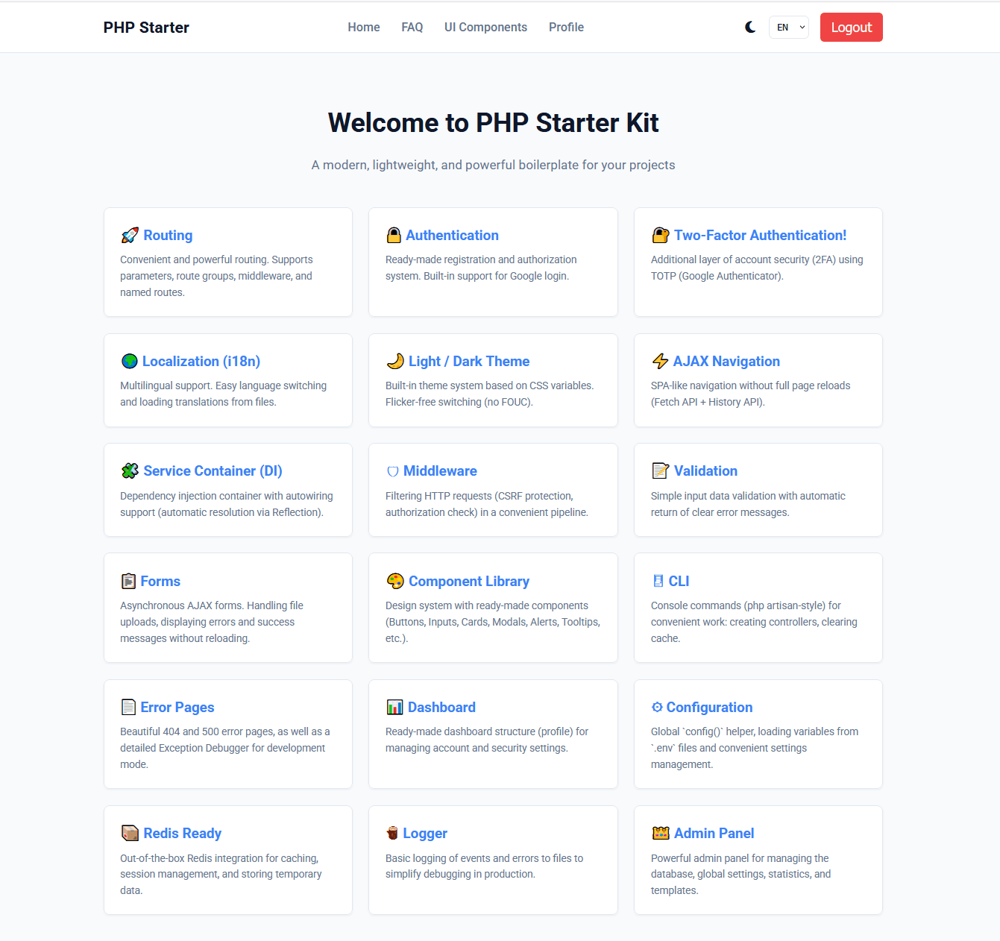
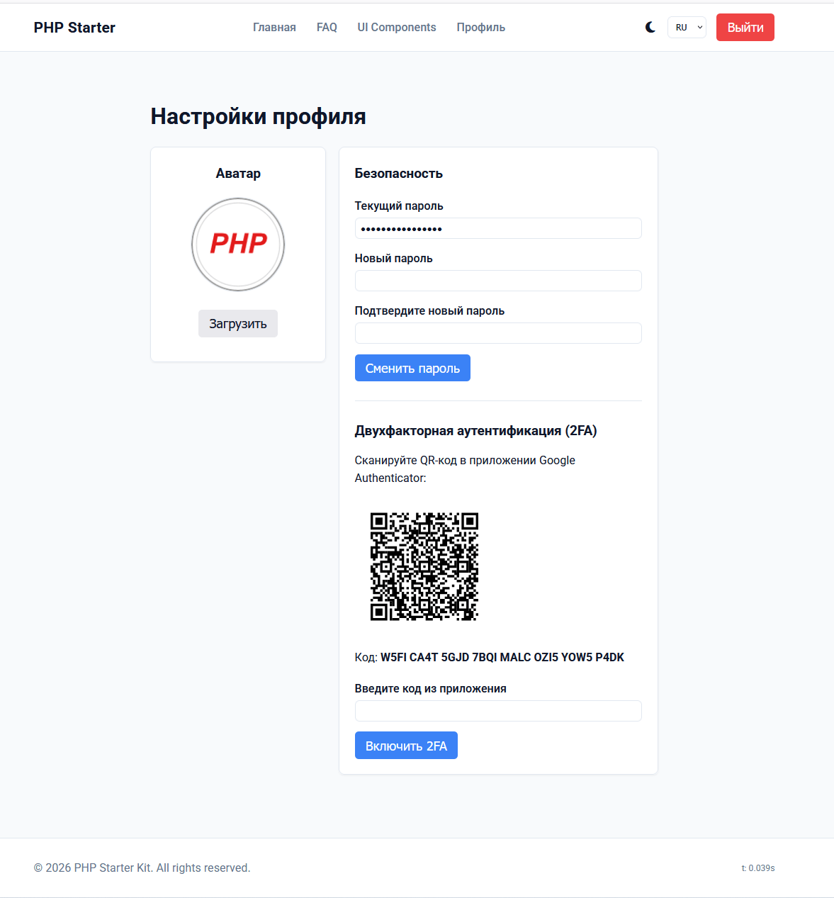
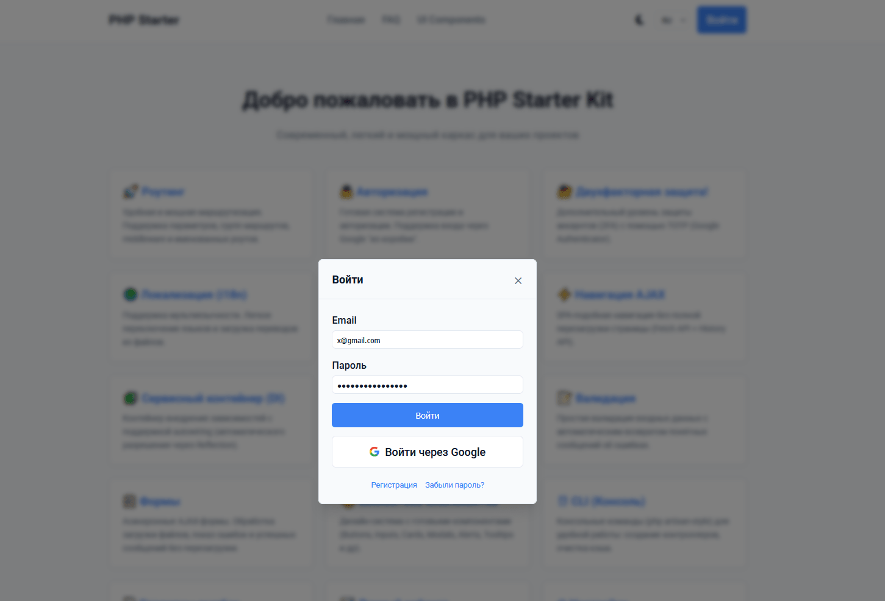
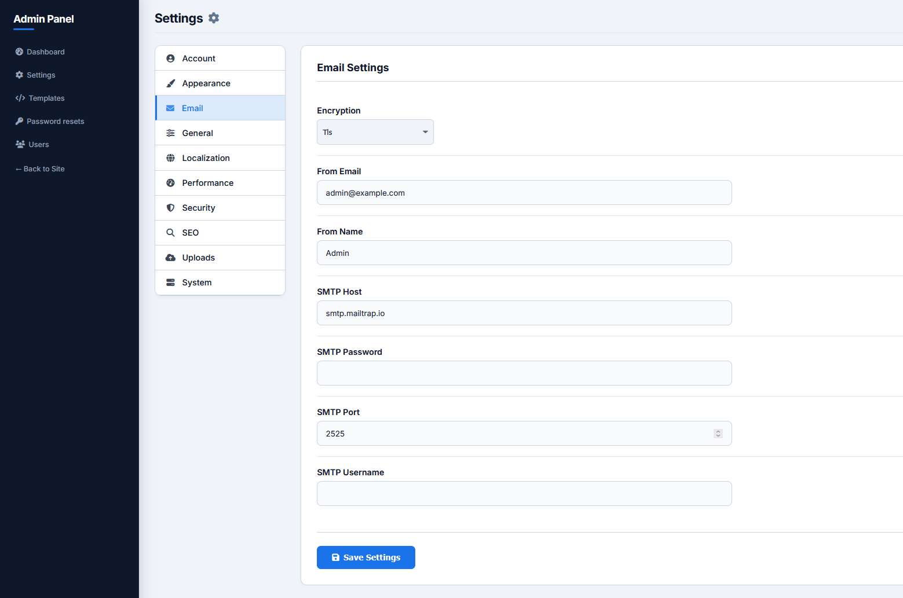

# PHP Starter Framework

A modern, lightweight PHP starter kit and micro-framework with a built-in admin panel, MVC architecture, and Docker support. Designed as a robust foundation for building secure and scalable web applications without the overhead of heavy frameworks.









[](https://packagist.org/packages/daranger/php-starter)
[](https://packagist.org/packages/daranger/php-starter)
[](https://github.com/daranger/php-starter/actions)

[](https://packagist.org/packages/daranger/php-starter)

---

## Core Features & Architecture

### 🛠️ Custom MVC Micro-framework
Built from scratch with zero heavy dependencies to keep the application blazing fast:
- **Routing Engine** — Supports GET, POST, route groups, prefixes, and parameter extraction.
- **Dependency Injection Container** — Intelligent container featuring **autowiring via Reflection**. Resolves dependencies recursively and supports singletons (`getInstance()->bind(...)`).
- **Middleware Pipeline** — Clean request filtering before hitting controllers. Includes built-in `AuthMiddleware`, `AdminMiddleware` (with dynamic IP whitelisting), and `CsrfMiddleware`.

### 🛡️ Security & Authentication
- **Secure Sessions** — Stored in Redis with automatic TTL for performance and security.
- **CSRF Protection** — Integrated middleware automatically generates and validates `_csrf` tokens on every POST request.
- **Authentication** — Bcrypt hashed passwords, rate-limiting against brute force, and ready-to-use 2FA logic.
- **Role-based Access Control (RBAC)** — Distinct permissions for regular users and administrators.

### 🌐 Localization (i18n)
- **Built-in Translation System** — A robust helper `__('key')` maps dictionary files from the `lang/` directory to strings in the current user's locale.
- **Session & DB tied** — Language preferences persist across sessions.

### 🎨 Themes & UI
- **Dark & Light Modes** — Native support for theme switching out of the box.
- **Dynamic Settings** — App name, mail host, UI settings are driven by the `settings` database table, configurable directly from the Admin Panel instead of hardcoded `.env` files.

### 📋 Logging & Telemetry
- **Database & File Logging** — User actions (`user_logs`) and daemon background jobs (`daemon_jobs_log`) are tracked.
- **System Dashboard** — Built-in `SystemService` that tracks server metrics (RAM, Disk, CPU Load Average, Uptime) and outputs them to the admin dashboard.

### 🐳 Docker Ready
- Comes with a complete `docker-compose.yml` for instant local development.
- Bundles Nginx, PHP-FPM 8.2, MySQL 8.0, and Redis 7.2.

---

## Stack

| Layer | Technology |
|---|---|
| Language | PHP 8.1+ |
| Web server | Nginx (via Docker) / Apache |
| Database | MySQL 8.0 / MariaDB |
| Cache / Sessions | Redis (Predis) |
| Mail | PHPMailer |
| Framework | Custom MVC (Container, Router, Middleware) |
| Tests | PHPUnit 11 |

---

## Requirements

- PHP 8.1+ (if running bare-metal)
- Composer
- MySQL 8.0+ or MariaDB
- Redis server
- **Or simply Docker & Docker Compose** for local development.

---

## Installation via Composer

The easiest way to start a new project is via Composer:
```bash
composer create-project daranger/php-starter my-new-app
cd my-new-app
```
Composer will automatically clone the repository, remove the git history, and install all dependencies.

---

## Installation via Docker (Alternative)

1. **Clone the repository**
   ```bash
   git clone https://github.com/daranger/php-starter.git
   cd php-starter
   ```

2. **Setup environment**
   ```bash
   cp .env.example .env
   # Edit .env to set your database credentials if needed
   ```

3. **Start the containers**
   ```bash
   docker-compose up -d
   ```

4. **Install PHP dependencies**
   ```bash
   docker-compose exec app composer install
   ```

5. **Run migrations & seed**
   ```bash
   # Make sure to run your database migrations/seeds here
   # e.g., import database/Migrations/*.sql
   ```

6. **Access the application**
   Open your browser and navigate to `http://localhost`.

---

## Testing

The framework includes a comprehensive test suite powered by PHPUnit.
```bash
composer dump-autoload
vendor/bin/phpunit
```

---

## License

This project is licensed under the MIT License — see the [LICENSE](LICENSE) file for details.
